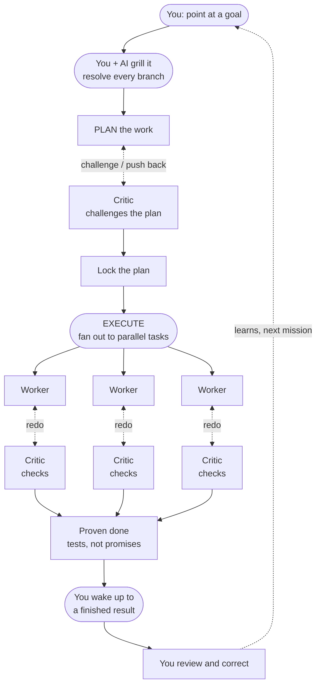
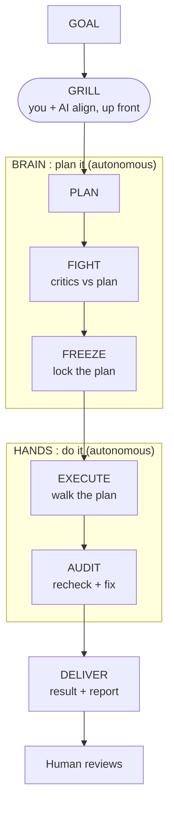
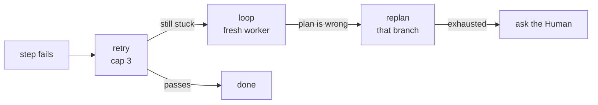
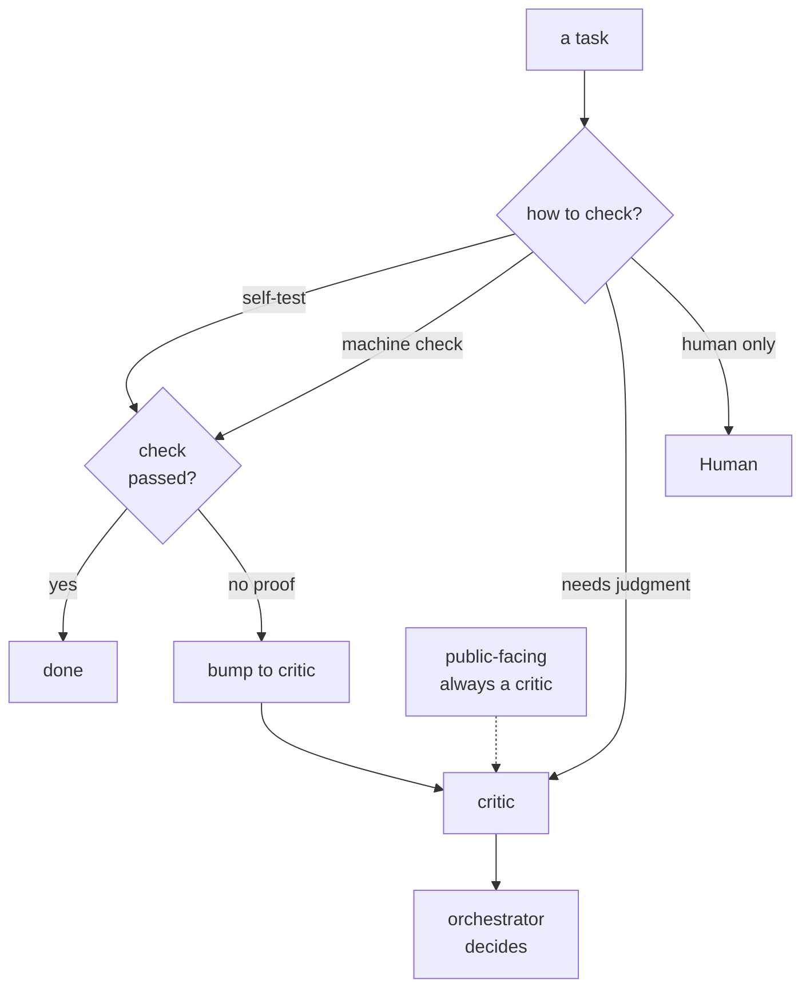
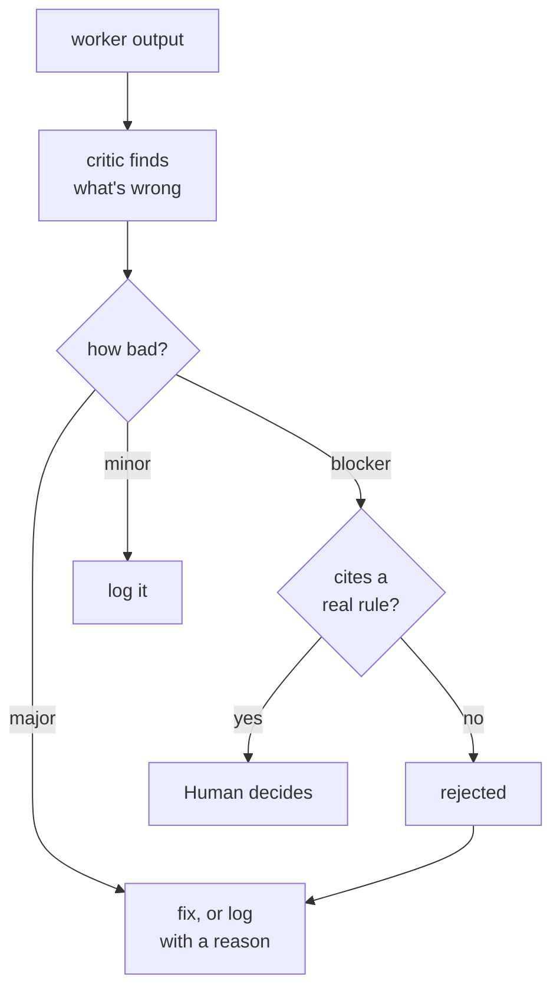
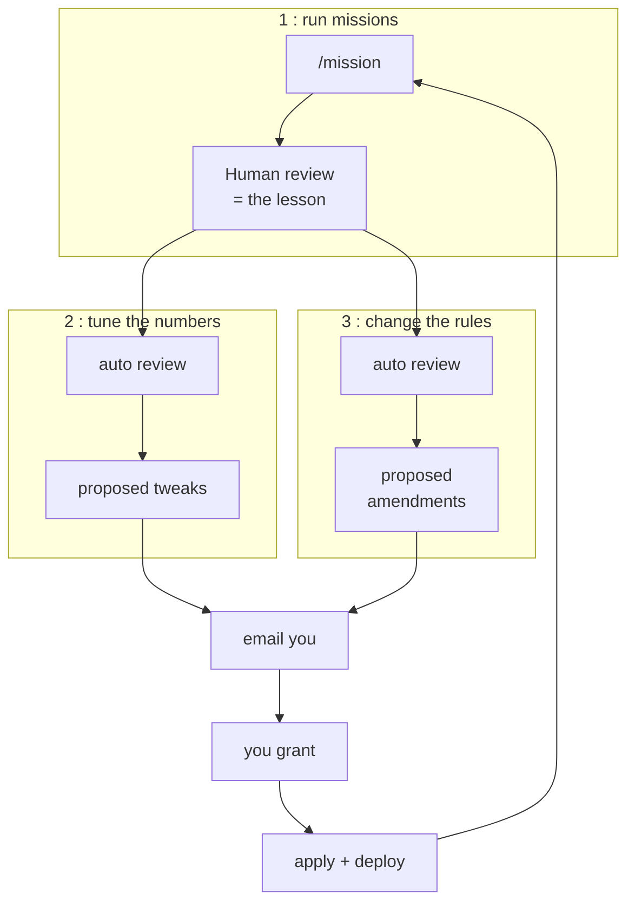
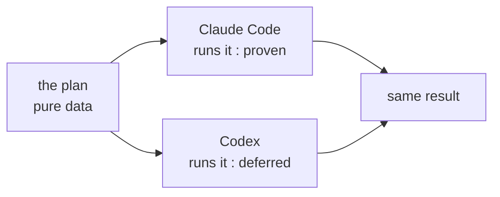
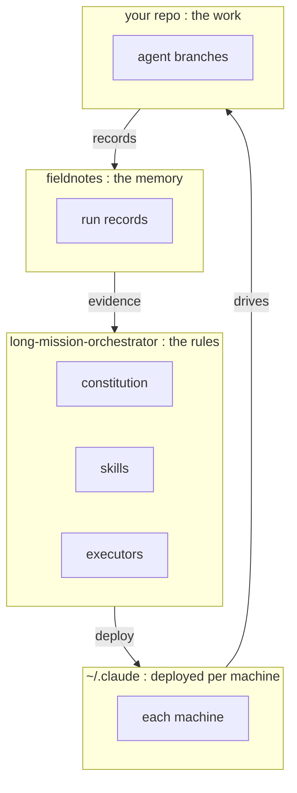

# long-mission-orchestrator

Point at a goal. Walk away. Wake up to finished, checked work — and a system that gets a
little sharper every time you correct it.

A framework for running **autonomous coding and writing missions** under a governing
constitution, for both software (internal tooling) and academic work (papers,
experiments).



*Read it top to bottom: you set the goal and grill it with the AI up front until every branch
is resolved — that conversation is the one human-in-the-loop moment. After that it runs
autonomously: a critic fights the plan, the work fans out into parallel tasks each shadowed by
its own checker, and what you correct in the morning feeds back into the next run. The grill up
front is what makes walking away safe.*

The whole thing rests on one idea: **the value is in proving "done," not in typing the
code.** A human points at a goal; an orchestrator plans it; a critic attacks the plan; a
worker does it; and a *verifier* — a test, a second opinion, not the worker's own say-so —
decides when it's actually finished.

> **Status:** v0.1, pre-first-mission. Design settled in a long grilling session; this repo
> is the canonical home. Operative files deploy into `~/.claude` (see [Deploy](#deploy)).

---

## The five ideas it's built on

1. **Proof lives outside the worker.** Nothing closes its own work by claiming success. A
   test, an independent critic, or the human decides.
2. **The verifier is the whole game.** Autonomy is bounded by how cheaply "done" can be
   checked. Strong check, run free. Weak check, draft options and let the human pick.
3. **Deterministic shell, smart core.** The loops, limits, and gates are plain machinery; the
   AI is used only where judgment is actually needed.
4. **Memory lives on disk.** Every step rebuilds its context from files. The frozen plan is
   the save-file. Fresh context beats one long session that drifts.
5. **Adding is free, destroying is forbidden.** Autonomous runs only add — branches, draft
   PRs, reports. Merging, deleting, anything outward-facing stays with the human.

---

## How a mission runs

One line of goal in; a finished, audited result out. The plan is **decided** first, then
**walked** — that split is what lets the same plan run on different AI tools.



### When a step gets stuck

It climbs one rung at a time — never skips. Don't replan what a retry fixes; don't retry what
only a replan can fix.



---

## How "done" is decided

Every task gets a check-level that says **who is allowed to call it finished**. The keystone
rule: a self-checkable task can't close without an actual passing check on record. No proof,
no close — it gets bumped up to a critic instead.



A critic is fresh-eyed, sees only the output, and is told to find what's wrong. Worker and
critic never argue directly — the orchestrator rules. Serious objections must cite a real
rule, and only the Human overrides them.



---

## How it learns

The framework improves itself from evidence, never vibes — and the **Human stays the final
approver**. The clever split: drafting an improvement is automatic; *applying* it always waits
for your grant. Full mechanics in [`docs/evolution.md`](docs/evolution.md).



What you change in the morning is the gold signal: the gap between what was delivered and what
you accepted is the only honest measure of where the framework was wrong. The improvement
review is itself a mission, so its proposals get attacked by a critic before they reach your
inbox.

---

## Works on more than one AI tool

The plan is **pure data** — no tool-specific tricks in it. The thing that runs it is a
swappable adapter.



---

## How it's wired

Governance, memory, and the actual work live in three separate places. One deploy step
installs the rules onto each machine.



---

## Repository layout

```
long-mission-orchestrator/
├── README.md                       # this file (story + diagrams)
├── docs/
│   ├── agent-constitution.md       # THE rules: read this first
│   ├── evolution.md                # how self-improvement works
│   └── adr/                        # decision records from the design grill
├── schema/
│   ├── mission-plan.schema.json    # the frozen plan (decided once, then walked)
│   ├── mission-record.schema.json  # one record per mission (what it learns from)
│   └── cap-log.format.md           # the limits-hit log
├── skills/
│   ├── mission.md                  # /mission: run a mission
│   ├── evolve.md                   # /evolve: scheduled self-improvement review
│   └── mission-accept.md           # /mission-accept: capture the gold signal
├── executors/
│   ├── mission-executor.workflow.js  # Claude Code adapter (proven)
│   └── mission-executor.codex.md     # Codex adapter (deferred)
├── scripts/
│   ├── deploy.ps1                  # install operative files into ~/.claude
│   └── deploy.sh
└── machine-profile.example.md      # per-machine (the real one is gitignored, local)
```

---

## Deploy

The repo is the **single source of truth**. `~/.claude` holds *deployed copies*. **Edit here,
then redeploy.** Never edit the `~/.claude` copies directly; they get overwritten.

```powershell
# on each machine, after cloning and pulling:
powershell -ExecutionPolicy Bypass -File scripts\deploy.ps1
```

Deploy copies the constitution, schemas, and codex spec into `~/.claude/docs/`, the skills
into `~/.claude/commands/`, and the Workflow executor into `~/.claude/workflows/`. On first
`/mission`, a new machine auto-drafts its gitignored, local `machine-profile.md`.

---

## Status and roadmap

- **Phase 0 DONE:** constitution, schemas, skills, executors, this repo.
- **Phase 1 next:** one attended daylight mission against `MILP-solver-paper`, full protocol
  live, with a kill-and-resume check folded in.
- **Phase 2:** one unattended-launched-live run, then a real overnight mission.
- **Later:** switch on the scheduled `/evolve` (needs run-records first); onboard the second
  machine; daylight-test the Codex adapter.
