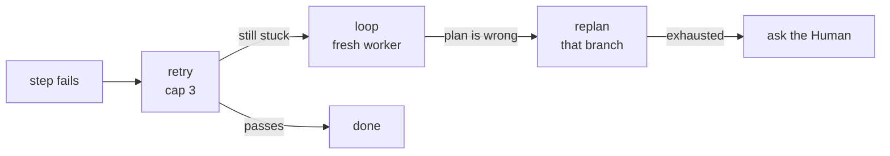
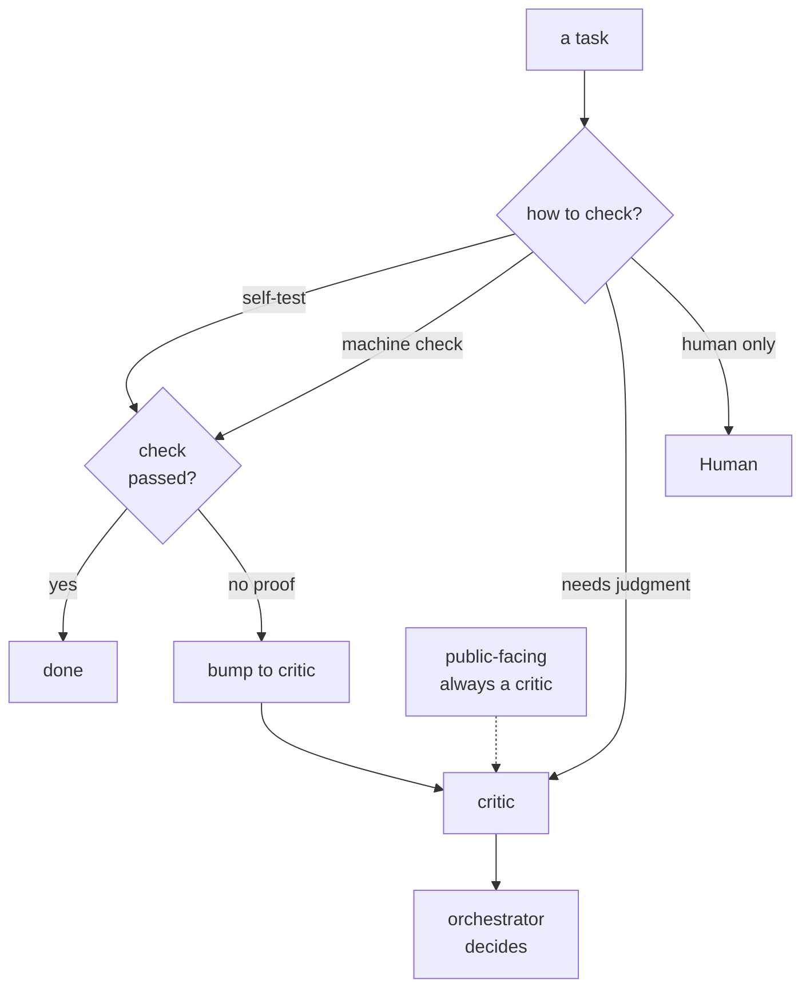
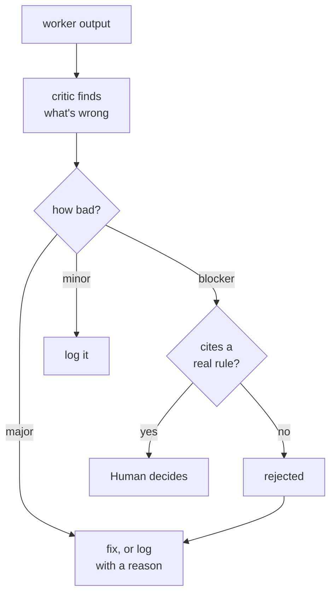
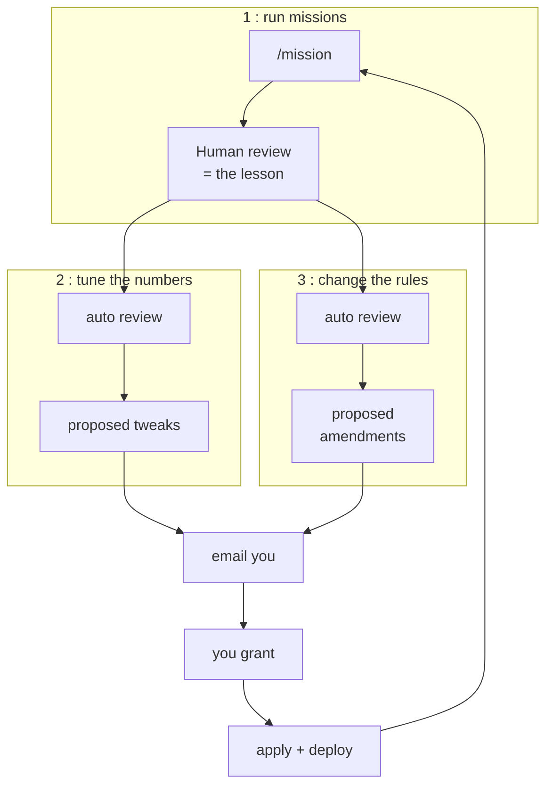
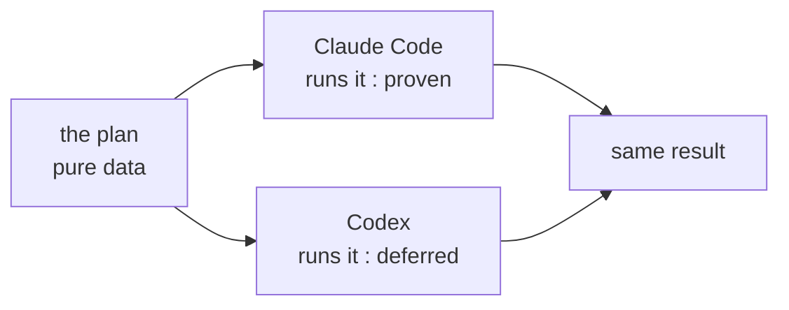
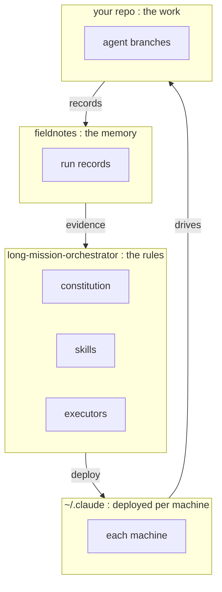

# long-mission-orchestrator

Point at a goal. Walk away. Wake up to finished, checked work — and a system that gets a
little sharper every time you correct it.

A framework for running **autonomous coding and writing missions** under a governing
constitution, for both software (internal tooling) and academic work (papers,
experiments).


*Read it top to bottom: you set the goal and grill it with the AI up front until every branch
is resolved — that conversation is the one human-in-the-loop moment. After that it runs
autonomously: a critic fights the plan, the work fans out into parallel tasks each shadowed by
its own checker, and what you correct in the morning feeds back into the next run. The grill up
front is what makes walking away safe.*

The whole thing rests on one idea: **the value is in proving "done," not in typing the
code.** A human points at a goal; an orchestrator plans it; a critic attacks the plan; a
worker does it; and a *verifier* — a test, a second opinion, not the worker's own say-so —
decides when it's actually finished.

> **Status:** v0.1, pre-first-mission. Design settled in a long grilling session; this repo
> is the canonical home. Operative files deploy into `~/.claude` (see [Deploy](#deploy)).

> **Honest scope.** Autonomy is strongest where verification is cheap (does it compile, do the
> tests pass, does the citation resolve) and on *drafting* (generate-and-rank). It is weakest
> exactly where research value lives — is the argument sound, the experiment right — because
> that is model-judged or human-only. A model critiquing a model is a *correlated* checker, not
> an independent one. Read the pitch as **an overnight drafting-and-mechanical-checking engine
> with a human gate**, not an autonomous researcher.

---

## The five ideas it's built on

1. **Proof lives outside the worker.** Nothing closes its own work by claiming success. A
   test, an independent critic, or the human decides.
2. **The verifier is the whole game.** Autonomy is bounded by how cheaply "done" can be
   checked. Strong check, run free. Weak check, draft options and let the human pick.
3. **Deterministic shell, smart core.** The loops, limits, and gates are plain machinery; the
   AI is used only where judgment is actually needed.
4. **Memory lives on disk.** Every step rebuilds its context from files. The frozen plan is
   the save-file. Fresh context beats one long session that drifts.
5. **Adding is free, destroying is forbidden.** Autonomous runs only add — branches, draft
   PRs, reports. Merging, deleting, anything outward-facing stays with the human.

---

## How a mission runs

One line of goal in; a finished, audited result out. The plan is **decided** first, then
**walked** — that split is what lets the same plan run on different AI tools.


### When a step gets stuck

It climbs one rung at a time — never skips. Don't replan what a retry fixes; don't retry what
only a replan can fix.



---

## How "done" is decided

Every task gets a check-level that says **who is allowed to call it finished**. The keystone
rule: a self-checkable task can't close without an actual passing check on record. No proof,
no close — it gets bumped up to a critic instead.



A critic is fresh-eyed, sees only the output, and is told to find what's wrong. Worker and
critic never argue directly — the orchestrator rules. Serious objections must cite a real
rule, and only the Human overrides them.



---

## How it learns

The framework improves itself from evidence, never vibes — and the **Human stays the final
approver**. The clever split: drafting an improvement is automatic; *applying* it always waits
for your grant. Full mechanics in [`docs/evolution.md`](docs/evolution.md).



What you change in the morning is the gold signal: the gap between what was delivered and what
you accepted is the only honest measure of where the framework was wrong. The improvement
review is itself a mission, so its proposals get attacked by a critic before they reach your
inbox.

---

## Works on more than one AI tool

The plan is **pure data** — no tool-specific tricks in it. The thing that runs it is a
swappable adapter.



*One adapter is proven (Claude Code); the Codex path is specified but **untested**. You don't
know a spec is harness-neutral until a second consumer runs it and reveals the leaked
assumptions — so treat "same result" as a design intent, not a demonstrated fact.*

---

## How it's wired

Governance, memory, and the actual work live in three separate places. One deploy step
installs the rules onto each machine.



---

## Design sparks

The ideas this project is proud of — concepts that crystallized while designing it. Some are
original, some are sharp recombinations; all are load-bearing.

### Trust & verification
- **Four-level verification ladder (V0–V3).** Every task carries a check-level that decides
  *who is permitted to close it* — self-testable, machine-checkable, judge-checkable,
  human-only. A permission system for the word "done."
- **Close-time binding.** A self-checkable task cannot close without an actually-run, recorded,
  passing check; no proof on record → automatic downgrade to a critic. Self-report never closes
  work. (Arrived at by *ablating* plan-time check-naming: bind the check at the moment of
  maximum information, not up front.)
- **The verifier is the whole game.** Autonomy is bounded by how cheaply "done" is checkable —
  treated as a hard design constraint, not an afterthought.

### Adversarial review without sycophancy
- **Triangulated adjudication.** Actor and critic never talk directly; each speaks only to an
  orchestrator that rules. Direct dialogue is the channel sycophancy travels — so remove it.
  The actor gets exactly one rebuttal per finding; the fight ends by ruling, never by consensus.
- **Citation-gated blockers.** A "blocker" is valid only if it cites a named rule or criterion;
  uncited → demoted to "major." Keeps the critic's strongest word narrow and kills manufactured
  severity.
- **Asymmetric rounding.** Verification class rounds *up* under uncertainty (protect
  correctness); severity rounds *down* to "major" (protect the human's attention). Opposite
  defaults, because they guard different scarce resources.

### Where the human stands
- **The grill, up front.** The one human-in-the-loop conversation sits right after the goal:
  resolve every branch while you are present, then walk away. *Attended launch, autonomous
  flight.*
- **Four morning signals.** A run reports exactly one of DELIVERED / DIVERGED / IN-FLIGHT(ETA) /
  silence — and silence means *dead*, so a late run is never mistaken for a crash.
- **Escalation precision is measured.** Every escalated blocker gets a one-tap legit/noise
  verdict; a falling legit-rate is evidence to tighten the critics. A safety channel that cries
  wolf is worse than none.

### Autonomy that degrades gracefully
- **No-stall + defect ledger.** A run never blocks waiting on a human; it ships the best
  artifact within limits and *confesses every shortfall in writing*. "Write down every defect"
  pressures the worker to fix; "lousy is acceptable" would invite sloth — same outcome, opposite
  psychology.
- **The problem-solving ladder.** A stuck step climbs one rung at a time — retry, then
  fresh-context loop, then replan-the-branch — never skipping. Don't replan what a retry fixes;
  don't retry what only a replan can fix.
- **Finalize on divergence, not on a clock.** A run is killed when progress stops shrinking, not
  at a deadline. A late plane still lands; only a circling one is brought down.

### Self-improvement, safely
- **Three nested loops.** Missions do the work, calibration tunes the numbers, evolution amends
  the rules — each slower, each gated by the human.
- **The human-diff is the gold signal.** What you change before accepting a result is the only
  honest measure of where the system was wrong; everything else is the system grading its own
  homework.
- **Generate ≠ apply.** Drafting a self-amendment is automated and safe; *applying* one always
  waits for your grant. A system that emails its own proposed rule-change is doing homework; one
  that applies it un-granted is the failure mode the perimeter exists to prevent.
- **Caps are iterated, not asserted.** The retry/loop/replan limits start as guesses and
  self-calibrate from a log of where they actually bind — but the human approves every change.
- **The perimeter.** A self-modifying system with a fixed spine: agents may *propose* changes to
  blast-radius, merge authority, and the verification floors, but never apply them. The
  constitution evolves; its core cannot self-edit.

### Portable & durable
- **plan.json is the brain↔hands contract.** The plan is pure data with no tool-specific tricks,
  so the same mission can be planned by one AI tool and executed by another.
- **Roles, not hostnames.** Synced rules speak in roles (light / heavy); each machine binds them
  to its real hardware locally. Add a machine, write one profile, change nothing else.
- **The orchestrator-armed heartbeat.** A mission survives token-limits, crashes, and reboots
  through one idempotent contingency that resumes from disk — no clock arithmetic, and not a
  user-facing feature.
- **Three-way separation.** Governance (the rules), telemetry (the memory), and working-state
  (the actual work) live in three separate places and never mix.

---

## Repository layout

```
long-mission-orchestrator/
├── README.md                       # this file (story + diagrams)
├── docs/
│   ├── agent-constitution.md       # THE rules: read this first
│   ├── evolution.md                # how self-improvement works
│   └── adr/                        # decision records from the design grill
├── schema/
│   ├── mission-plan.schema.json    # the frozen plan (decided once, then walked)
│   ├── mission-record.schema.json  # one record per mission (what it learns from)
│   └── cap-log.format.md           # the limits-hit log
├── skills/
│   ├── mission.md                  # /mission: run a mission
│   ├── evolve.md                   # /evolve: scheduled self-improvement review
│   └── mission-accept.md           # /mission-accept: capture the gold signal
├── executors/
│   ├── mission-executor.workflow.js  # Claude Code adapter (proven)
│   └── mission-executor.codex.md     # Codex adapter (deferred)
├── scripts/
│   ├── deploy.ps1                  # install operative files into ~/.claude
│   └── deploy.sh
└── machine-profile.example.md      # per-machine (the real one is gitignored, local)
```

---

## Deploy

The repo is the **single source of truth**. `~/.claude` holds *deployed copies*. **Edit here,
then redeploy.** Never edit the `~/.claude` copies directly; they get overwritten.

```powershell
# on each machine, after cloning and pulling:
powershell -ExecutionPolicy Bypass -File scripts\deploy.ps1
```

Deploy copies the constitution, schemas, and codex spec into `~/.claude/docs/`, the skills
into `~/.claude/commands/`, and the Workflow executor into `~/.claude/workflows/`. On first
`/mission`, a new machine auto-drafts its gitignored, local `machine-profile.md`.

---

## Implementation status (v0.1)

The prose describes a richer machine than the executor yet runs — normal pre-first-mission,
but stated plainly so the "deterministic shell" claim stays honest. The Claude Code executor
(`executors/mission-executor.workflow.js`) currently implements: the wave-based DAG walk,
fan-out, close-time binding (V0/V1 self-closure requires a recorded passing check, else
auto-downgrade to a critic), the micro-loop retry, and one actor→critic→adjudicate pass.

**Specified but not yet in the executor — Phase 1 work:**
- **Subtree replan** (the ladder's top rung) — currently the node is marked done-with-defect
  and the walk continues; it does not yet redraw the branch.
- **In-node rebuttal round** — §3.3 grants the actor one evidence-based rebuttal per finding;
  the code runs actor→critic once and returns `blocked` without the rebuttal cycle.
- **Audit → punchlist → fix loop** — AUDIT assembles the punchlist but does not yet re-enter
  EXECUTE to work it.

None of this is run-tested (no mission has executed). The Codex adapter is a spec, not an
implementation. Treat the system as a designed protocol with a partial reference executor, not
a finished engine.

## Status and roadmap

- **Phase 0 DONE:** constitution, schemas, skills, executors, this repo.
- **Phase 1 next:** one attended daylight mission against `MILP-solver-paper`, full protocol
  live, with a kill-and-resume check folded in.
- **Phase 2:** one unattended-launched-live run, then a real overnight mission.
- **Later:** switch on the scheduled `/evolve` (needs run-records first); onboard the second
  machine; daylight-test the Codex adapter.
