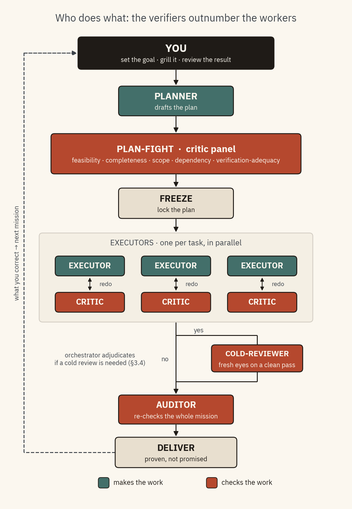

# long-mission-orchestrator

Point at a goal. Walk away. Wake up to finished, checked work — and a system that gets a little
sharper every time you correct it.

A framework for running **autonomous coding and writing missions** under a governing
constitution, for both software (internal tooling) and academic work (papers, experiments).



*The conceptual diagrams for each piece (mission flow, the verification ladder, the learning loops, the wiring) live in [`docs/architecture-diagrams.md`](docs/architecture-diagrams.md). The figure above is generated by [`scripts/render_role_diagram.py`](scripts/render_role_diagram.py).*

**The whole thing rests on one idea: the value is in proving "done," not in typing the code.**
You grill the goal up front — the one human-in-the-loop moment — then the roles take over: a
**planner** drafts the plan, **critics** fight it, **executors** fan out in parallel (each
shadowed by its own **critic** in a redo loop), a **cold-reviewer** brings fresh eyes to a clean
pass, and an **auditor** re-verifies the whole mission. A *verifier* — a test or an independent
critic, never the worker's own say-so — decides when something is finished, and what you change in
the morning feeds the next run.

> **Honest scope.** Autonomy is strongest where verification is cheap (compiles, tests pass,
> citation resolves) and on *drafting* (generate-and-rank). It is weakest exactly where research
> value lives — is the argument sound, the experiment right — because that is model-judged or
> human-only, and a model critiquing a model is a *correlated* checker, not an independent one.
> Read this as **an overnight drafting-and-mechanical-checking engine with a human gate**, not an
> autonomous researcher.

---

## What's new in v0.2

Right-sizing, cost, and the human-feedback loop — driven by evidence from the first real mission.

| Feature | What it does | Why |
|---|---|---|
| **Mission classes (M0–M2)** | sizes *ceremony* to the mission — an errand skips the plan-fight, heartbeat, audit pass, and go-gate | stop *marching an army for a typo* |
| **Deterministic class guard** | a script (`classify-mission.js`) computes the class; the planner may only *raise* it | M0 can't self-label its way out of every gate |
| **Operating card** | workers carry a ~1.5 KB brief, not the ~26 KB constitution | cut the per-agent governance reload |
| **Cold-improver loop** | fresh eyes improve a *first draft*, fed back to the worker to revise | review yields most on fresh drafts, not polished summaries |
| **Blast-radius parallelism** | nodes fan out only when their declared `write_set`s are disjoint | safe parallel by blast radius, not blind isolation |
| **Active decision loop** | `/mission-log-audit` surfaces decisions *to you* on a cadence | human attention is the scarcest resource — pull, don't wait |

---

## The five ideas it's built on

1. **Proof lives outside the worker.** Nothing closes its own work by claiming success — a test, an independent critic, or the human decides.
2. **The verifier is the whole game.** Autonomy is bounded by how cheaply "done" can be checked. Strong check, run free; weak check, draft options and let the human pick.
3. **Deterministic shell, smart core.** Loops, limits, and gates are plain machinery; the AI is used only where judgment is actually needed.
4. **Memory lives on disk.** Every step rebuilds its context from files; the frozen plan is the save-file. Fresh context beats one long session that drifts.
5. **Adding is free, destroying is forbidden.** Autonomous runs only add — branches, draft PRs, reports. Merging and anything outward-facing stays with the human.

---

## How "done" is decided

Every task carries a **verification class** — who is allowed to call it finished. The keystone:
a self-checkable task **cannot close without an actual passing check on record**; no proof → it's
bumped up to a critic.

| Class | Meaning | Who closes it |
|---|---|---|
| **V0** | self-testable (runs its own tests) | the worker — *only* with a recorded passing check |
| **V1** | machine-checkable (compile, lint, script exits 0) | the harness — *only* with a recorded passing check |
| **V2** | judge-checkable (quality is a judgment) | an independent critic, adjudicated by the orchestrator |
| **V3** | human-only (taste, stakes, irreversibility) | the human, always |

A critic is fresh-eyed, sees only the output, and is told to find what's wrong. Worker and critic
never argue directly — the orchestrator rules. A "blocker" is valid only if it cites a named rule;
uncited ones are demoted. Round verification *up* under uncertainty (protect correctness); round
severity *down* to "major" (protect the human's attention).

---

## Concepts worth knowing

- **Close-time binding** — bind the check at the moment of maximum information (close time), not at plan time; no recorded pass → automatic downgrade to a critic.
- **Mission-size ladder (M0–M2)** — a second dial beside the V-ladder: V-class sizes verification *per node*, mission class sizes ceremony *per mission*. Scales ceremony only, never the verification floors.
- **Triangulated adjudication** — actor and critic never talk directly (that channel is where sycophancy travels); each speaks only to an orchestrator that rules. One rebuttal per finding, then a decision — never consensus.
- **The grill, up front** — the single human-in-the-loop conversation sits right after the goal: resolve every branch while you're present, then walk away. *Attended launch, autonomous flight.*
- **The human-diff is the gold signal** — the gap between what was delivered and what you accepted is the only honest measure of where the system was wrong; everything else is it grading its own homework.
- **Generate ≠ apply** — the framework drafts its own improvements automatically, but *applying* one always waits for your grant. The perimeter (blast radius, merge authority, verification floors) can be *proposed* for change but never self-applied.
- **Four morning signals** — a run reports exactly one of DELIVERED / DIVERGED / IN-FLIGHT(ETA) / silence, and silence means *dead* — so a late run is never mistaken for a crash.
- **`plan.json` is the brain↔hands contract** — the plan is pure data with no tool-specific tricks, so one AI tool can plan a mission and another can execute it.

---

## Repository layout

```
long-mission-orchestrator/
├── docs/
│   ├── agent-constitution.md       # THE rules — read first
│   ├── operating-card.md           # the ~1.5 KB worker brief
│   └── evolution.md                # how it improves itself
├── schema/                         # plan.json, run-record, cap-log formats
├── skills/
│   ├── mission.md                  # /mission — run a mission
│   ├── evolve.md                   # /evolve — self-improvement review
│   └── mission-log-audit.md        # /mission-log-audit — surface decisions to you
├── executors/
│   ├── mission-executor.workflow.js  # Claude Code adapter (the reference runtime)
│   └── mission-executor.codex.md     # Codex adapter (spec, deferred)
├── scripts/
│   ├── classify-mission.js         # deterministic mission-class guard
│   ├── mailbridge.py               # §12 email transport (proven plaid-finance channel, standalone)
│   ├── mission_mailbox.py          # report/walkthrough/proposal out; poll + route feedback in
│   └── deploy.ps1 / deploy.sh      # install operative files into ~/.claude
└── proposals/                      # /evolve amendment drafts awaiting grant
```

Three places, never mixed: **governance** (this repo), **telemetry** (a fieldnotes repo holds
run-records), **working-state** (agent branches in your target repo).

---

## Deploy

The repo is the **single source of truth**; `~/.claude` holds *deployed copies*. **Edit here,
then redeploy** — never edit the `~/.claude` copies directly.

```powershell
powershell -ExecutionPolicy Bypass -File scripts\deploy.ps1   # (or: bash scripts/deploy.sh)
```

Copies the constitution, operating card, and schemas into `~/.claude/docs/`, skills into
`commands/`, the executor into `workflows/`, and helper scripts into `scripts/`. On first
`/mission`, a new machine auto-drafts its gitignored local `machine-profile.md`.

---

## Status (v0.2, pre-first-mission)

The reference executor (`mission-executor.workflow.js`) implements: the wave-based DAG walk,
close-time binding, the micro-loop retry, the actor→critic→adjudicate gate, mission-class–scaled
audit, the operating-card split, the cold-improver→revision loop, the blast-radius parallelism
*decision*, and the deterministic class guard.

**The §12 email channel is wired** (`scripts/mailbridge.py` + `scripts/mission_mailbox.py`,
deployed to `~/.claude/scripts/`): a mission emails REPORT.md / decision walk-throughs / proposals,
and an authenticated reply is polled (`LMO\MailboxPoll`) and routed into the fieldnotes run-record
(verdicts) or `/evolve apply` (token-gated grants) — the proven plaid-finance transport, governed
by the §9 perimeter via a deny-list. Config lives at `~/.claude/mailbridge.env` (machine-local).

**Specified but not yet wired:** subtree replan, the §3.3 gate-critic rebuttal, the
audit→punchlist→fix loop, the worktree fan-out, and full multi-round cold-reviewer rotation. No
mission has run under v0.2, and the Codex adapter is a spec. Treat this as **a designed protocol
with a partial reference runtime, not a finished engine** — stated plainly so the
"deterministic shell" claim stays honest.
