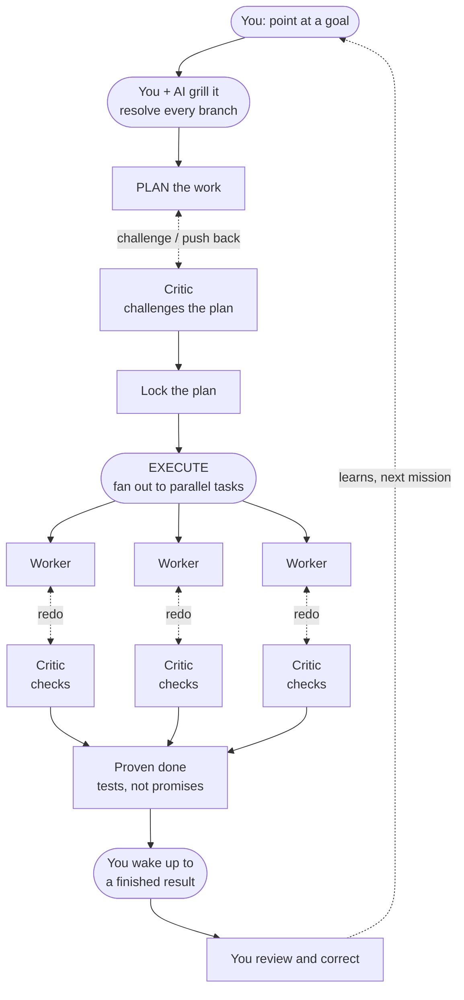
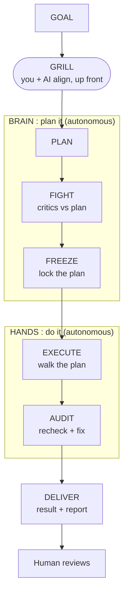
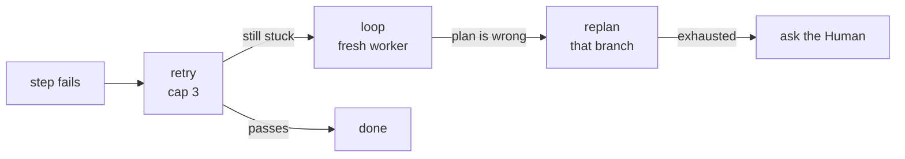
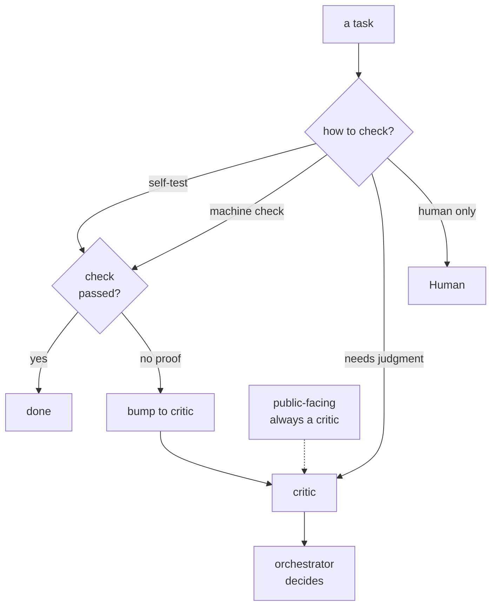
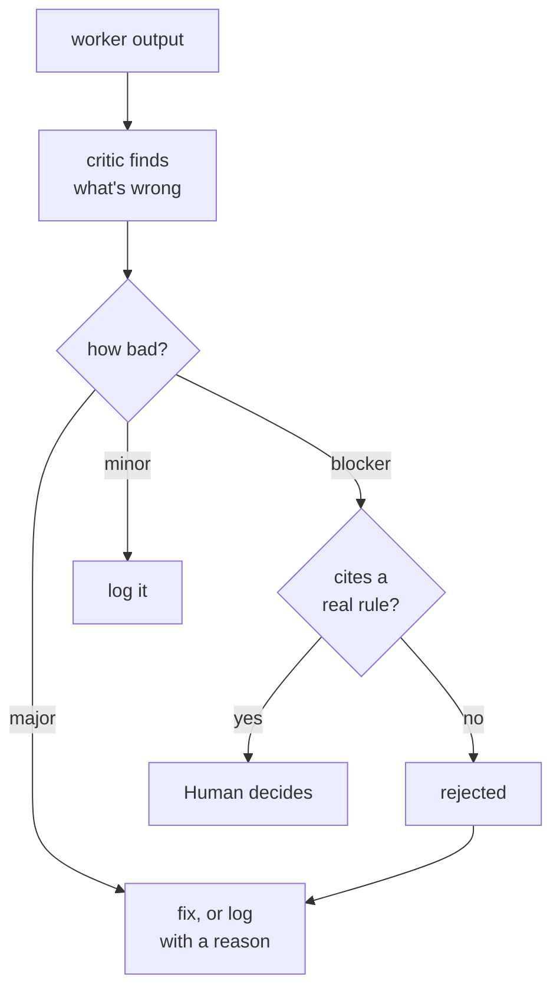
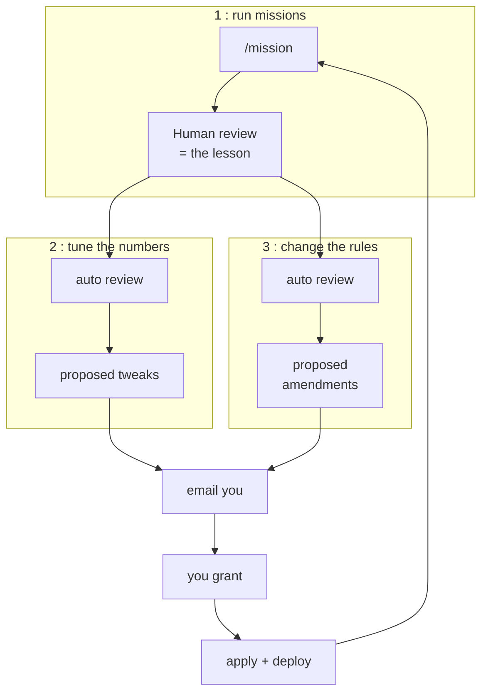
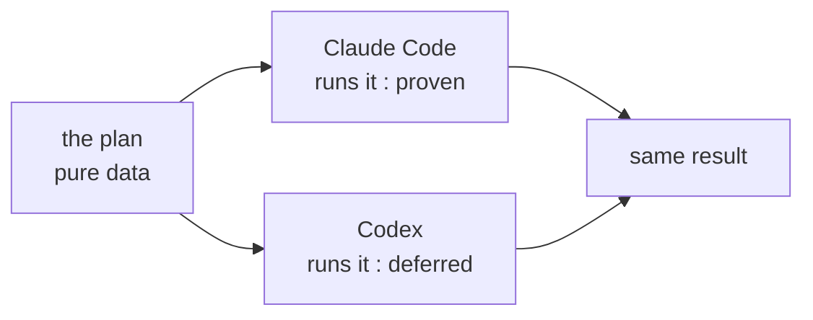
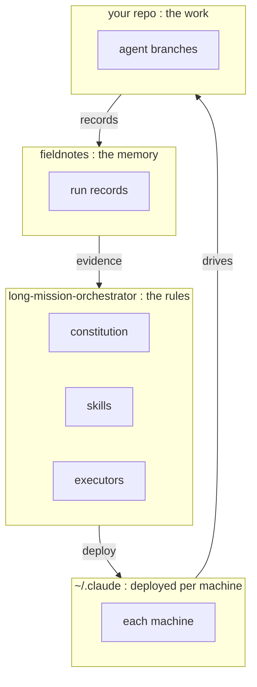

# Architecture diagrams

The conceptual diagrams for the mission protocol. The README hero is now a single rendered role
org-chart (`docs/role-diagram.png`); these mermaid diagrams expand each piece of the system and
are kept here as explanatory reference, not promoted to the README.

---

## The mission, end to end

You set the goal and grill it up front (the one human-in-the-loop moment); after that a critic
fights the plan, the work fans out into parallel tasks each shadowed by its own checker, and what
you correct feeds the next run.

---

## Brain vs hands — the plan is decided first, then walked

The split is what lets the same plan run on different AI tools: the BRAIN decides it (plan,
fight, freeze), the HANDS walk it (execute, audit).

---

## When a step gets stuck — climb one rung at a time

Don't replan what a retry fixes; don't retry what only a replan can fix.

---

## How "done" is decided

Every task gets a check-level that says who may close it. The keystone: a self-checkable task
can't close without an actual passing check on record — no proof, no close; it gets bumped to a
critic.

---

## Severity and adjudication — a blocker must cite a real rule

Worker and critic never argue directly; the orchestrator rules. Only the Human overrides a valid
blocker.

---

## How it learns — three nested loops, human-gated

Drafting an improvement is automatic; applying one always waits for your grant.

---

## Works on more than one AI tool

The plan is pure data; the runtime is a swappable adapter. (Claude Code is proven; the Codex path
is specified but untested.)

---

## How it's wired — three places, never mixed

Governance (the rules), telemetry (the memory), and working-state (the actual work) live apart.

